# PRD — Adaptive AI Travel Decision Engine

## 1. Product Name

**Adaptive AI Travel Planner**

### One-line pitch

An AI travel decision engine that generates, validates, scores, and continuously re-optimizes itineraries based on traveller preferences, budget, time, route, weather, events, availability, and real-world changes.

---

## 2. Objective

Build a working AI travel planning system that goes beyond static itinerary generation.

The system must:

1. Understand traveller requirements.
2. Retrieve relevant travel data.
3. Generate possible itinerary options.
4. Apply hard constraints.
5. Score remaining options using soft constraints.
6. Generate the best itinerary.
7. Explain why the itinerary was selected.
8. Detect changes such as weather changes, place closures, budget changes, and user preference changes.
9. Automatically re-optimize the itinerary.
10. Show the user what changed and why.

The AI should behave like a **travel decision engine**, not simply a conversational chatbot.

---

## 3. Problem

Most AI travel planners generate a static list:

```text
Destination + Dates
        ↓
       LLM
        ↓
    Itinerary
```

This system instead operates as:

```text
Traveller
    ↓
Constraints + Preferences
    ↓
Travel Data
    ↓
Candidate Activities
    ↓
Hard Constraint Validation
    ↓
Optimization
    ↓
Best Itinerary
    ↓
Real-world Change
    ↓
Re-optimization
    ↓
Updated Itinerary
```

---

## 4. Hackathon MVP Scope

Because implementation time is limited, prioritize the following.

### MUST HAVE

#### A. Traveller Profile

Inputs:

- Destination/cities
- Start date
- End date
- Number of travellers
- Budget
- Interests
- Travel style
- Activity intensity
- Food preference
- Walking preference

Example:

```json
{
  "cities": ["Jaipur", "Jodhpur"],
  "startDate": "2026-10-12",
  "endDate": "2026-10-17",
  "travellers": 2,
  "budget": 30000,
  "interests": ["culture", "food", "shopping"],
  "activityLevel": "moderate",
  "walkingLevel": "moderate",
  "foodPreference": "vegetarian"
}
```

---

## 5. Travel Data Model

Create a structured local dataset for the MVP.

Do not attempt to cover all of India during the hackathon.

Use approximately:

- 5–10 cities
- 10–20 places per city
- 5–10 activities per city
- 5–10 restaurants per city
- Several events

Prioritize data quality over quantity.

### Place

```json
{
  "id": "place_001",
  "name": "City Palace",
  "city": "Jaipur",
  "category": "culture",
  "description": "...",
  "cost": 300,
  "durationMinutes": 120,
  "openingTime": "09:30",
  "closingTime": "17:00",
  "latitude": 26.9258,
  "longitude": 75.8237,
  "tags": ["culture", "history", "architecture"],
  "indoor": false,
  "weatherSensitive": true,
  "status": "open",
  "rating": 4.5,
  "verificationStatus": "verified"
}
```

### Activity

```json
{
  "id": "activity_001",
  "name": "Local Food Walk",
  "city": "Jaipur",
  "category": "food",
  "cost": 800,
  "durationMinutes": 120,
  "difficulty": "easy",
  "weatherSensitive": false,
  "tags": ["food", "culture"]
}
```

### Event

```json
{
  "id": "event_001",
  "name": "Cultural Festival",
  "city": "Jaipur",
  "date": "2026-10-14",
  "startTime": "18:00",
  "endTime": "21:00",
  "cost": 0,
  "category": "culture",
  "verified": true
}
```

---

## 6. AI Architecture

Implement this pipeline:

```text
USER
 ↓
Intent Detection
 ↓
Context Builder
 ↓
Travel Data Retrieval
 ↓
Candidate Generation
 ↓
Hard Constraint Filtering
 ↓
Soft Constraint Scoring
 ↓
Itinerary Optimization
 ↓
Validation
 ↓
LLM Explanation
 ↓
FINAL ITINERARY
```

For changes:

```text
EXTERNAL/USER CHANGE
 ↓
Detect affected itinerary items
 ↓
Remove invalid activities
 ↓
Generate replacement candidates
 ↓
Hard constraint filtering
 ↓
Re-score
 ↓
Re-optimize
 ↓
Validate
 ↓
UPDATED ITINERARY
```

---

## 7. Hard Constraints

These constraints must never be violated.

### Budget

```text
totalCost <= userBudget
```

### Date

```text
startDate <= activityDate <= endDate
```

### Opening Hours

```text
activityStart >= openingTime
activityEnd <= closingTime
```

### Time

Account for:

```text
activity duration
+
travel time
+
buffer
```

### Schedule Conflict

Never allow overlapping activities.

Also reject transitions where the available gap is smaller than the required travel time.

### Place Status

Reject:

- closed
- temporarily_closed
- maintenance
- restricted

unless explicitly presented as an alternative scenario.

### Safety

Reject or warn for:

- unsafe conditions
- restricted areas
- dangerous weather
- closed roads
- natural hazards

---

## 8. Soft Constraint Scoring

After hard constraints remove invalid candidates, calculate:

```text
Final Score =

Preference Match       × 0.30
Budget Efficiency      × 0.20
Time Efficiency        × 0.15
Route Efficiency       × 0.15
Weather Suitability    × 0.10
Event Relevance        × 0.05
Freshness              × 0.05
```

Make weights configurable.

Do not hardcode weights throughout the application.

---

## 9. Preference Matching

Calculate how well each candidate matches the traveller.

Example:

```text
User:

Culture      HIGH
Food         HIGH
Adventure    LOW
Shopping     MEDIUM
```

Candidates should receive normalized preference scores.

---

## 10. Budget Optimization

Track:

- Total estimated cost
- Spent
- Remaining budget
- Cost per traveller
- Daily budget

Example:

```text
TOTAL BUDGET        ₹30,000

Accommodation       ₹8,000
Food                ₹5,000
Transport           ₹4,000
Activities          ₹6,500

Estimated Total    ₹23,500
Remaining           ₹6,500
```

The AI must use the remaining budget when deciding whether additional activities can be added.

---

## 11. Route Optimization

For each day:

```text
Start Location
      ↓
Activity A
      ↓
Activity B
      ↓
Activity C
      ↓
Hotel
```

Calculate:

- distance
- travel time
- unnecessary backtracking

Prefer geographically clustered activities.

---

## 12. Time Optimization

Every activity must have:

```text
startTime
endTime
duration
travelTimeFromPrevious
buffer
```

Example:

```text
09:30 – 11:30
City Palace

11:30 – 12:00
Travel

12:00 – 13:00
Local Lunch

13:00 – 13:30
Travel

13:30 – 15:30
Museum
```

Never generate overlapping activities.

---

## 13. Weather-Aware Planning

Support weather input:

```json
{
  "condition": "rain",
  "rainProbability": 85,
  "temperature": 24
}
```

If an activity is weather-sensitive and conditions become unsuitable:

```text
Remove activity
 ↓
Find indoor alternatives
 ↓
Check budget
 ↓
Check opening hours
 ↓
Check route
 ↓
Re-score
 ↓
Replace
```

---

## 14. Dynamic Place Closure

This is a major demo feature.

Example:

```text
Amer Fort
status = temporarily_closed
```

System:

```text
Detect closure
       ↓
Find affected itinerary item
       ↓
Generate replacement candidates
       ↓
Apply hard constraints
       ↓
Score candidates
       ↓
Select best replacement
       ↓
Recalculate itinerary
```

User sees:

> Amer Fort is temporarily unavailable.

> Replacement: Albert Hall Museum

> Why: Strong preference match, suitable travel time, lower cost, and compatible with the remaining schedule.

---

## 15. Dynamic Budget Change

If user says:

> "I only have ₹1,000 left."

The engine should recalculate the remaining itinerary:

```text
Current itinerary
        ↓
Remaining budget = ₹1,000
        ↓
Find affordable alternatives
        ↓
Re-score
        ↓
Update itinerary
```

---

## 16. Dynamic User Preference Change

If user says:

> "I don't want forts anymore."

The system should:

```text
Detect preference change
       ↓
Find affected activities
       ↓
Remove them
       ↓
Find alternatives
       ↓
Re-optimize
       ↓
Return revised itinerary
```

---

## 17. AI Chatbot

Support these intents:

- create_itinerary
- modify_itinerary
- recommend_place
- recommend_activity
- recommend_food
- nearby_recommendation
- weather_question
- budget_question
- place_information
- event_information
- transport_question
- change_preference
- replan_itinerary

---

## 18. Tool Layer

Implement:

```text
search_places()
search_activities()
search_events()
get_weather()
calculate_route()
calculate_budget()
get_place_status()
update_itinerary()
```

Example:

```text
"What should I do tomorrow if it rains?"
        ↓
get_weather()
        ↓
search_activities(weather="rain")
        ↓
calculate_route()
        ↓
generate recommendation
```

---

## 19. Itinerary Output

Return structured JSON:

```json
{
  "tripSummary": {
    "days": 3,
    "estimatedCost": 13850,
    "budget": 15000,
    "remainingBudget": 1150,
    "preferenceScore": 91,
    "feasibilityScore": 96
  },
  "days": [
    {
      "date": "2026-10-12",
      "city": "Jaipur",
      "activities": [
        {
          "name": "City Palace",
          "startTime": "09:30",
          "endTime": "11:30",
          "cost": 300,
          "travelMinutes": 0,
          "score": 94,
          "reason": "Strong culture preference match"
        }
      ]
    }
  ]
}
```

---

## 20. Explainability

Every itinerary should provide:

### Why this itinerary?

```text
✓ 92% preference match
✓ ₹1,150 under budget
✓ No schedule conflicts
✓ 24% less travel than alternative
✓ All places currently open
✓ Weather compatible
✓ Includes relevant local event
```

Do not expose hidden chain-of-thought.

Only expose decision factors and concise explanations.

---

## 21. "What Changed?" Panel

When replanning occurs:

```text
ITINERARY UPDATED

Removed
❌ Amer Fort
Reason: Temporarily closed

Added
✓ Albert Hall Museum

Budget
Before: ₹13,850
After: ₹13,550

Travel time
Before: 4h 20m
After: 3h 55m

Preference match
Before: 91%
After: 93%
```

This must be visually prominent.

---

## 22. Alternative Plans

Generate three options when practical:

### Option A — Best Overall

```text
Score: 92
Cost: ₹14,200
Travel: 3h 40m
```

### Option B — Cheapest

```text
Score: 87
Cost: ₹11,800
Travel: 4h 10m
```

### Option C — Most Relaxed

```text
Score: 89
Cost: ₹14,800
Travel: 2h 50m
```

---

## 23. Data Trust

Every important record should contain:

```text
source
sourceUrl
lastVerifiedAt
verificationMethod
confidenceScore
expiresAt
```

Display trust state:

```text
🟢 Verified
Updated 2 days ago
```

or:

```text
🟡 Estimated
```

Never present AI-generated information as verified fact.

---

## 24. Evaluation Dashboard

Create a developer/admin panel showing:

```text
AI PERFORMANCE

Intent Accuracy           94%
Budget Compliance         97%
Time Feasibility          95%
Preference Match          91%
Opening Hours Valid       98%
No Conflicts              96%
Replanning Success        94%
Hallucination Rate         2%
```

These are example benchmark outputs. The system must calculate actual values from the test dataset rather than hardcoding them.

Create at least **20–50 fixed evaluation scenarios**.

---

## 25. Evaluation Test Cases

At minimum:

1. Normal 3-day Jaipur trip
2. Low-budget Jaipur trip
3. Family trip with low walking
4. Heavy rain scenario
5. Major attraction closure
6. Budget reduction
7. Preference change
8. Only 4 hours available
9. Multi-city trip
10. Event added to trip
11. Restaurant/food preference
12. Transport-time conflict
13. Attraction closing before planned visit
14. User asks for an unavailable activity
15. Unknown/fake place query

Measure:

- Intent correctness
- Constraint compliance
- Factual correctness
- Recommendation relevance
- Replanning correctness

---

## 26. UI Requirements

The UI should feel like an **AI travel command center**, not a generic chatbot.

### Main screen

```text
Adaptive Travel AI

Jaipur → Jodhpur → Udaipur
12 Oct – 17 Oct

Budget
₹30,000

Estimated
₹27,850

Remaining
₹2,150

Preference Match
92%

Feasibility
96%

[ View Itinerary ]
[ Re-optimize Trip ]
```

---

## 27. Itinerary Screen

For each day display:

- date
- city
- time
- activity
- duration
- cost
- travel time
- weather
- status
- score
- reason

Example:

```text
DAY 2 — JAIPUR

09:30
City Palace
Culture · 2h
₹300

       ↓ 12 min

12:00
Local Food Experience
Food · 1h
₹500

       ↓ 15 min

14:00
Museum
Culture · 2h
₹200
```

---

## 28. Live Adaptation UI

Include a prominent:

### Re-optimize Trip

When triggered, show:

```text
Checking:

✓ Weather
✓ Place status
✓ Events
✓ Budget
✓ Opening hours
✓ Travel time
✓ Availability
```

Then show the updated itinerary and what changed.

---

## 29. Technical Stack

Use the existing project stack where possible.

### Frontend

- Next.js
- React
- TypeScript
- Tailwind CSS

### Backend

- Python
- FastAPI

### Database

- PostgreSQL
- pgvector if already available

### AI

Use an LLM API.

Do NOT fine-tune or train an LLM from scratch for the hackathon.

### Maps

Use the existing maps provider/API.

### Weather

Use the existing weather API.

---

## 30. API Endpoints

Implement:

```http
POST /api/ai/chat
POST /api/ai/itinerary
POST /api/ai/replan
POST /api/ai/recommend
```

Additional:

```http
GET /api/places
GET /api/activities
GET /api/events
GET /api/weather

POST /api/itinerary/validate
POST /api/itinerary/score
```

---

## 31. Critical Architecture Rule

Do NOT let the LLM directly decide whether an itinerary is valid.

The LLM proposes.

The deterministic engine validates.

```text
LLM
 ↓
Candidate itinerary
 ↓
Deterministic validator
 ↓
Invalid?
 ├── YES → regenerate/re-optimize
 └── NO → accept
```

This separation is mandatory.

---

## 32. Definition of Done

The MVP is complete when this entire scenario works:

### Input

```text
Jaipur
3 days
₹15,000
2 people
Culture + Food
Moderate activity
```

### System

1. Generates itinerary.
2. Calculates cost.
3. Calculates remaining budget.
4. Checks time.
5. Checks route.
6. Checks opening hours.
7. Scores preferences.
8. Shows explanation.

### Then change:

```text
Weather → Heavy Rain
```

The system identifies affected outdoor activities and replaces them.

### Then change:

```text
Amer Fort → Temporarily Closed
```

The system replaces it.

### Then change:

```text
Budget → ₹10,000
```

The system re-optimizes.

### Final itinerary must:

- Stay within budget
- Have no time conflicts
- Respect opening hours
- Respect preferences
- Minimize unnecessary travel
- Adapt to weather
- Adapt to closures
- Explain changes

---

## 33. What NOT to Build

For the hackathon MVP, do not spend time on:

- Voice AI
- AR navigation
- Image recognition
- Full booking system
- Social network
- Traveller matching
- Large-scale knowledge graph
- Fine-tuning
- Training an LLM
- 100+ cities
- Complex ML recommendation model
- Advanced analytics

Focus on the adaptive itinerary engine.

---

## 34. Final Product Positioning

Do NOT describe the product as:

> "An AI chatbot for travelling."

Describe it as:

> **Adaptive AI Travel Decision Engine**

> A continuously optimizing travel planner that doesn't just generate an itinerary — it validates, scores and repairs the itinerary as traveller preferences, budget and real-world conditions change.

The core demonstration should be:

```text
CREATE
  ↓
OPTIMIZE
  ↓
VALIDATE
  ↓
TRAVEL
  ↓
WEATHER CHANGES
  ↓
PLACE CLOSES
  ↓
BUDGET CHANGES
  ↓
RE-OPTIMIZE
  ↓
EXPLAIN
```

---

## 35. Antigravity Build Instructions

### Priority 1 — Functionality

Build the complete end-to-end flow first:

```text
Trip Input
→ Candidate Retrieval
→ Constraint Filtering
→ Scoring
→ Itinerary Generation
→ Validation
→ Replanning
```

### Priority 2 — Demo

Make the following scenario work perfectly:

```text
Create Jaipur trip
→ Generate itinerary
→ Trigger rain
→ Replace outdoor activity
→ Trigger place closure
→ Replace closed attraction
→ Reduce budget
→ Re-optimize
→ Show before/after comparison
```

### Priority 3 — UI

Only after the above works:

- Polish dashboard
- Add animations
- Improve cards
- Add maps
- Add charts

### Priority 4 — Additional data

Only after the core engine works:

- Add more cities
- Add more activities
- Add more events
- Add more restaurants

### Do not replace the deterministic optimization/validation layer with an LLM-only implementation.

The system must demonstrate actual algorithmic decision-making around the LLM.


---

# 36. Software Engineering Architecture

This section defines the engineering structure required for the hackathon MVP.

The architecture must keep the LLM, deterministic optimization engine, data layer, external tools, and validation layer separated.

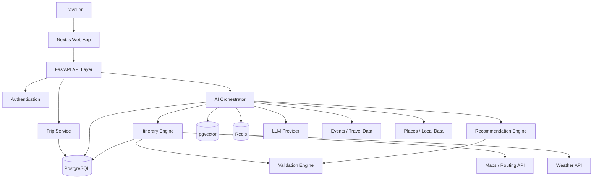

### Architecture principle

```text
LLM = reasoning + language + intent understanding

Deterministic code = constraints + calculations + validation + optimization

Database/APIs = source of travel facts
```

Never allow the LLM alone to decide whether an itinerary is valid.

---

# 37. High-Level System Context Diagram

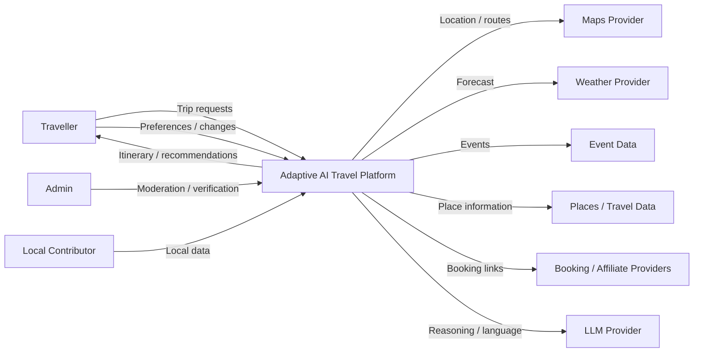

---

# 38. Container Architecture

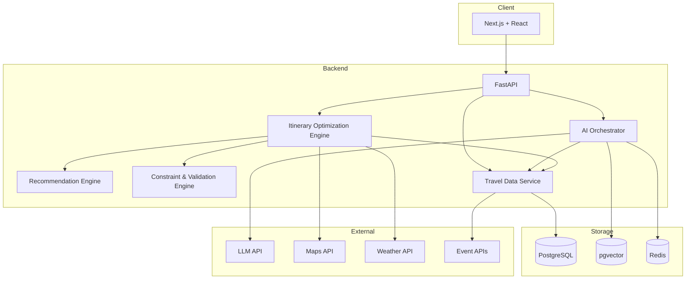

---

# 39. Component Architecture

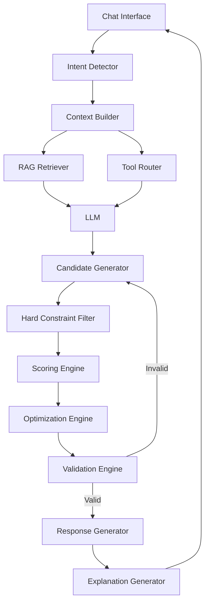

---

# 40. AI Agent State Machine

The AI should maintain a structured state rather than treating every message as an independent request.

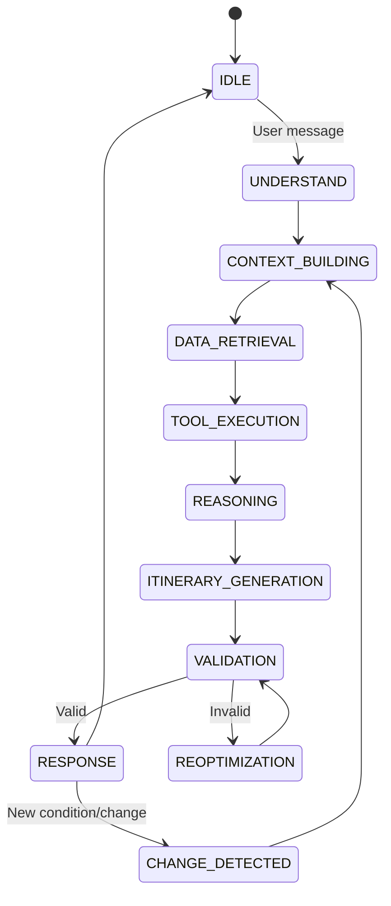

---

# 41. End-to-End Itinerary Generation Sequence

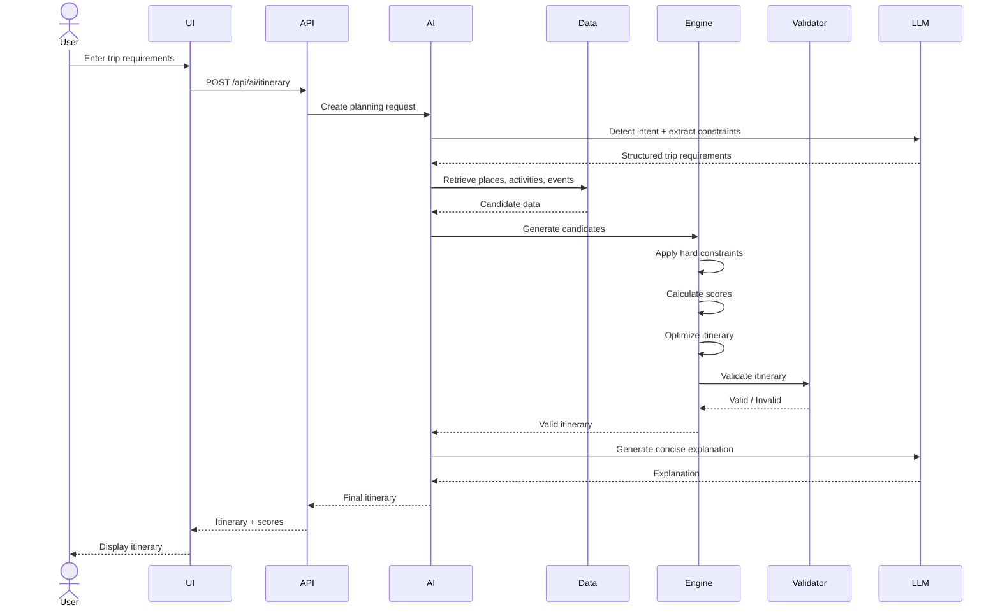

---

# 42. Dynamic Replanning Sequence

This is the core competitive feature.

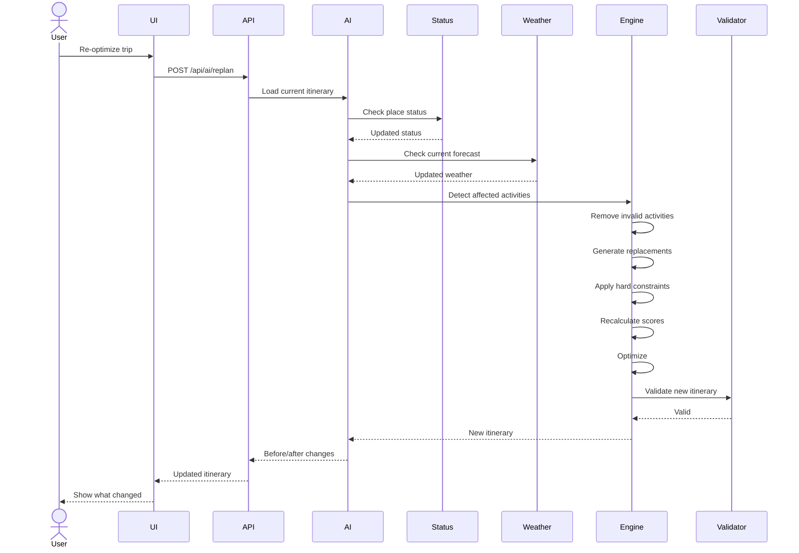

---

# 43. Itinerary Optimization Flowchart

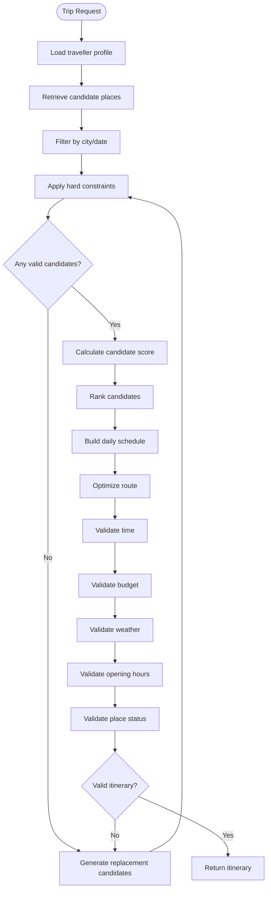

---

# 44. Hard Constraint vs Soft Constraint Architecture

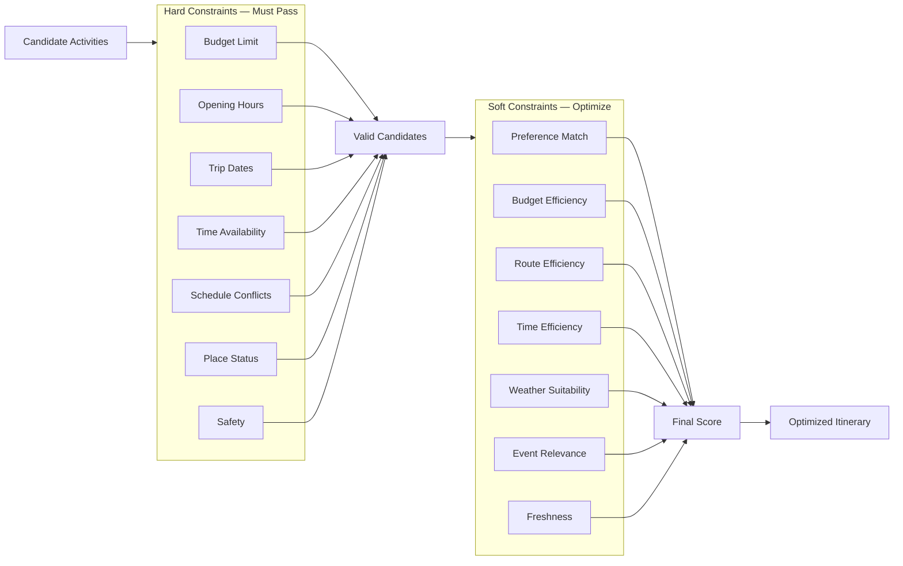

---

# 45. Recommendation Scoring Architecture

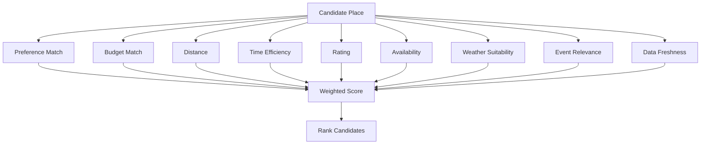

---

# 46. RAG Architecture

The chatbot should retrieve travel facts rather than relying on the LLM's internal knowledge.

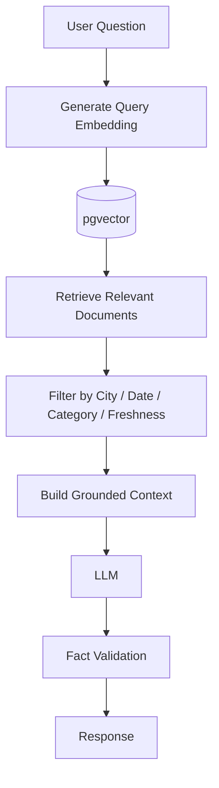

---

# 47. Data Trust Pipeline

Travel information is time-sensitive.

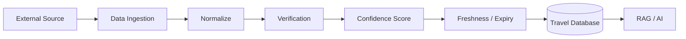

Each important record should contain:

```text
source
source_url
last_verified_at
verification_method
confidence_score
expires_at
```

---

# 48. Database ER Diagram

Use the following simplified schema for the MVP.

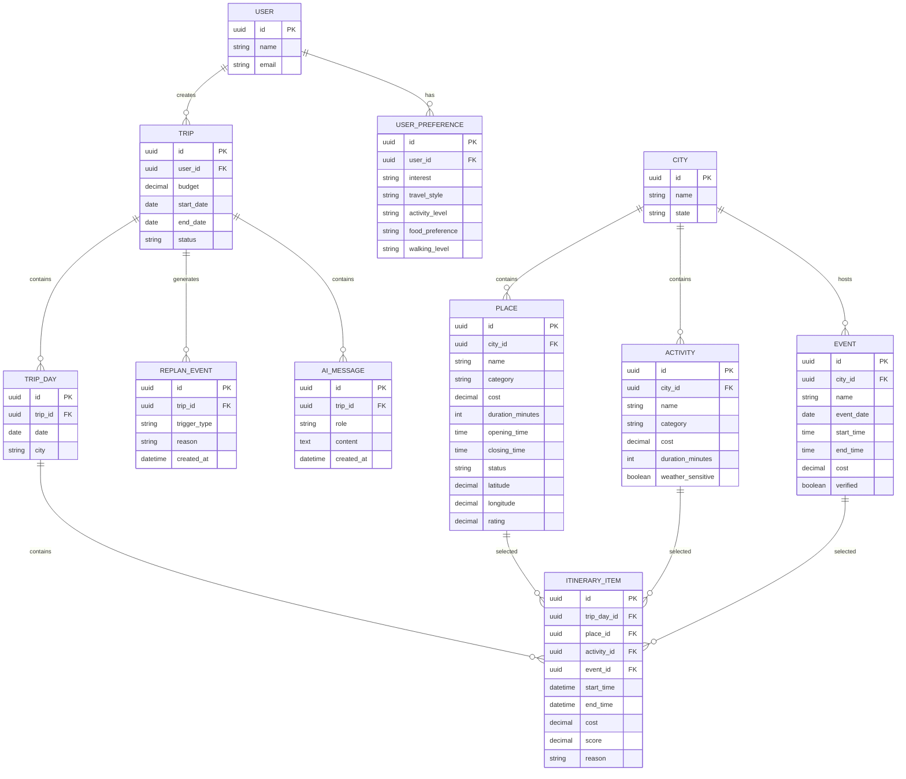

---

# 49. API Architecture

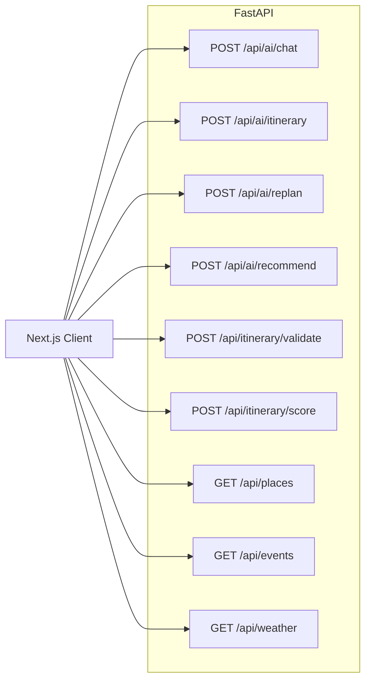

---

# 50. API Request Flow

### Generate Itinerary

```text
POST /api/ai/itinerary

Request
 ↓
Validate input
 ↓
Build trip context
 ↓
Retrieve candidates
 ↓
Optimize
 ↓
Validate
 ↓
Return structured itinerary
```

### Replan

```text
POST /api/ai/replan

Request
 ↓
Load existing trip
 ↓
Identify changed conditions
 ↓
Find affected activities
 ↓
Generate replacements
 ↓
Re-optimize
 ↓
Validate
 ↓
Return before/after diff
```

---

# 51. Class / Service Structure

Recommended backend structure:

```text
backend/
│
├── app/
│   ├── main.py
│   │
│   ├── api/
│   │   ├── ai.py
│   │   ├── itinerary.py
│   │   ├── places.py
│   │   ├── events.py
│   │   └── weather.py
│   │
│   ├── services/
│   │   ├── ai_orchestrator.py
│   │   ├── itinerary_engine.py
│   │   ├── recommendation_engine.py
│   │   ├── constraint_validator.py
│   │   ├── route_service.py
│   │   ├── weather_service.py
│   │   ├── place_status_service.py
│   │   └── data_retrieval_service.py
│   │
│   ├── models/
│   │   ├── user.py
│   │   ├── trip.py
│   │   ├── place.py
│   │   ├── activity.py
│   │   └── event.py
│   │
│   ├── schemas/
│   │   ├── trip.py
│   │   ├── itinerary.py
│   │   └── ai.py
│   │
│   ├── core/
│   │   ├── config.py
│   │   ├── scoring.py
│   │   └── constants.py
│   │
│   └── tests/
│       ├── test_itinerary.py
│       ├── test_constraints.py
│       ├── test_scoring.py
│       └── test_replanning.py
│
└── requirements.txt
```

---

# 52. Frontend Structure

```text
frontend/
│
├── app/
│   ├── page.tsx
│   ├── trip/
│   │   └── page.tsx
│   ├── itinerary/
│   │   └── page.tsx
│   └── ai/
│       └── page.tsx
│
├── components/
│   ├── TripForm.tsx
│   ├── AIChat.tsx
│   ├── ItineraryTimeline.tsx
│   ├── ItineraryCard.tsx
│   ├── BudgetPanel.tsx
│   ├── OptimizationScore.tsx
│   ├── ReplanPanel.tsx
│   ├── ChangeSummary.tsx
│   ├── WeatherPanel.tsx
│   └── MapView.tsx
│
├── lib/
│   ├── api.ts
│   └── types.ts
│
└── hooks/
    ├── useTrip.ts
    ├── useItinerary.ts
    └── useAI.ts
```

---

# 53. Software Design Principles

Follow these rules:

### Separation of concerns

```text
UI
 ↓
API
 ↓
Business Logic
 ↓
Data Layer
```

Do not put optimization logic directly inside React components.

### Single responsibility

Each service should have one primary responsibility.

### Deterministic validation

Budget, time, route, opening hours and conflicts should be deterministic wherever possible.

### AI abstraction

Keep LLM provider code behind an AI service interface so the model can be changed later.

### External API abstraction

Use service wrappers:

```text
WeatherService
MapsService
EventsService
PlacesService
```

Do not scatter API calls throughout the codebase.

---

# 54. Observability Architecture

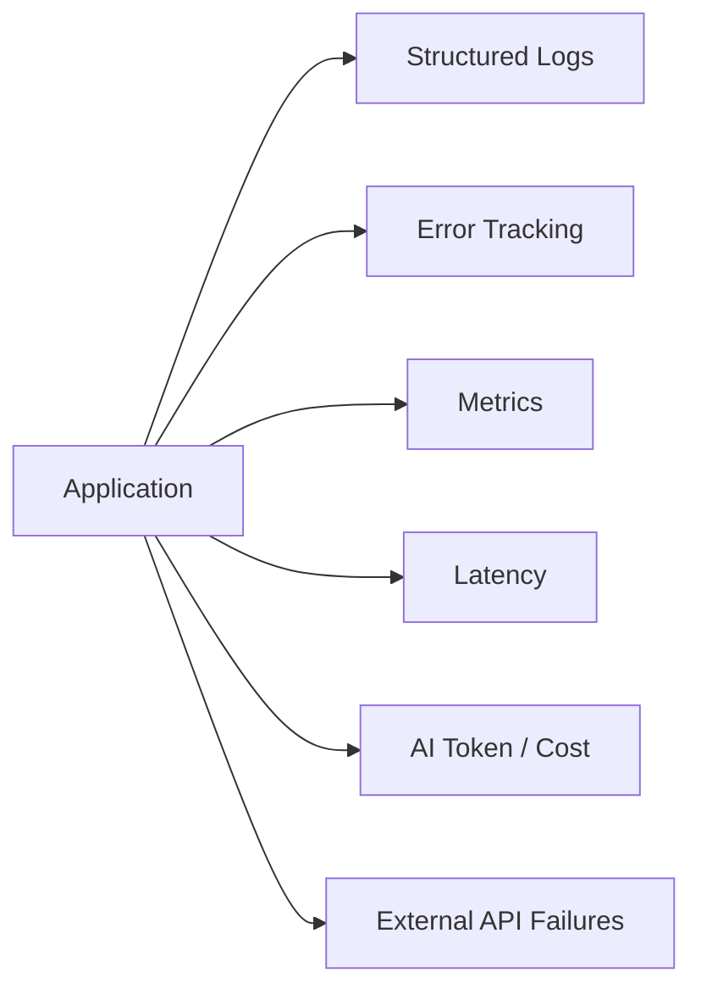

Track at minimum:

- AI response latency
- itinerary generation latency
- replan latency
- LLM token usage
- LLM cost
- API failures
- validation failures
- failed tool calls
- hallucination test results

---

# 55. Testing Pyramid

```text
                    /\
                   /  \
                  / E2E\
                 /------\
                /Integr. \
               /----------\
              / Unit Tests \
             /--------------\
```

### Unit tests

Test:

- Budget calculations
- Scoring
- Time calculations
- Conflict detection
- Opening-hour validation
- Route calculations

### Integration tests

Test:

- AI + database
- AI + weather
- AI + maps
- AI + itinerary engine
- AI + validation engine

### End-to-end test

```text
Create Trip
 ↓
Generate Itinerary
 ↓
Modify Trip
 ↓
Trigger Weather Change
 ↓
Replan
 ↓
View Updated Itinerary
```

---

# 56. Security Architecture

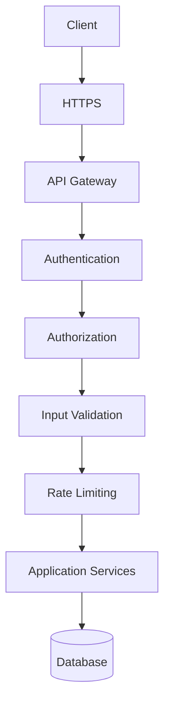

Implement:

- HTTPS
- Authentication
- Authorization
- Input validation
- Rate limiting
- Secrets through environment variables
- SQL injection protection
- XSS protection
- Secure file handling
- Audit logging

---

# 57. Deployment Architecture

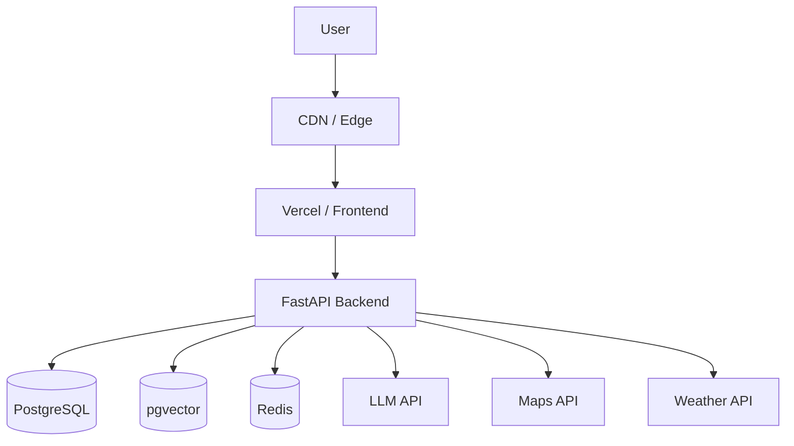

---

# 58. Final Hackathon Demo Architecture

The demo should visually communicate:

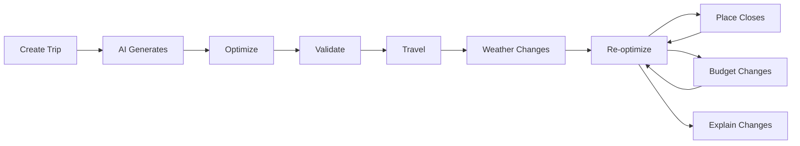

The judge should be able to see that:

```text
STATIC ITINERARY
       ❌

        vs

ADAPTIVE DECISION ENGINE
       ✅
```

---

# 59. Implementation Priority

Because this is a time-limited national-level hackathon:

## P0 — Absolutely required

```text
Trip input
AI itinerary generation
Hard constraints
Scoring
Validation
Budget
Time
Preference matching
Dynamic replanning
Before/after explanation
```

## P1 — Strong differentiators

```text
Weather adaptation
Place closure adaptation
Route optimization
Alternative itineraries
Data confidence
Evaluation dashboard
```

## P2 — Only if time remains

```text
RAG
More cities
Events
Advanced maps
Community data
Booking integrations
```

Do not allow P2 work to delay P0.

---

# 60. Antigravity Final Build Instruction

Build this PRD as a **working software engineering system**, not a static UI prototype.

The implementation must prioritize:

1. Functional backend.
2. Deterministic itinerary optimization.
3. Hard constraint validation.
4. AI orchestration.
5. Dynamic replanning.
6. Structured itinerary output.
7. Testable services.
8. Clear separation between LLM reasoning and deterministic business logic.
9. Working API endpoints.
10. A polished demonstration of the adaptive itinerary workflow.

Do not replace the optimization engine with a prompt that asks the LLM to "create the best itinerary."

The LLM should propose and reason.

The software should **calculate, validate, optimize, reject invalid plans, and re-plan**.

The final result should demonstrate genuine software-engineering and algorithmic intelligence rather than an LLM wrapper.
