# Travel Intelligence & Experience Platform — Product Requirements Document (PRD)

**Document Version:** 1.0  
**Date:** 22 August 2026  
**Status:** Product Definition / MVP Planning  
**Primary Market:** India  
**Primary Stack:** Next.js + Python + PostgreSQL + Maps + AI

---

## 1. Product Overview

### 1.1 Product Vision

Build a travel intelligence website for India that helps a traveller **discover, plan, book, experience, and remember a trip from one place**.

The platform should combine:

- Custom itinerary generation
- Destination and multi-city discovery
- Local and major events
- Activities and adventure sports
- Local culture, shopping and hidden places
- Flights, trains, buses and local transportation
- Hotels, hostels and dormitories
- Food and restaurant discovery
- Weather-aware itinerary planning
- Local guides and traveller communities
- AI virtual tourist guide
- Business-trip leisure recommendations
- Trip memories, galleries and notes
- Real-time place/status updates

The product should initially focus on **multiple cities across India**, with architecture that can later support international destinations.

### 1.2 Core Value Proposition

> **Tell us where you are going, when you are going, who is travelling, your budget and interests — the platform builds a practical trip plan and continuously helps you while travelling.**

---

# 2. Problem Statement

Travellers currently need several disconnected services:

- Google Maps for places
- Booking platforms for hotels
- Flight/train/bus platforms for transportation
- Instagram/YouTube for hidden places
- Search engines for events
- Separate weather applications
- Local blogs for food and shopping
- Social media for current local experiences
- Local guides for specialised trips

This creates five major problems:

1. **Information fragmentation**
2. **Difficulty building a realistic itinerary**
3. **Unclear total trip cost**
4. **Poor awareness of local/current events**
5. **Lack of contextual assistance while travelling**

The proposed platform solves this by creating a unified travel intelligence layer.

---

# 3. Goals and Objectives

## 3.1 Product Goals

1. Generate personalised travel itineraries.
2. Support multiple destinations/cities in one trip.
3. Calculate and display estimated trip budgets.
4. Discover current and upcoming activities/events.
5. Recommend places based on traveller profile.
6. Provide location-aware recommendations.
7. Integrate transportation and booking/deep-link providers.
8. Provide accommodation recommendations.
9. Provide weather information for planned dates.
10. Enable local guides and travellers to contribute information.
11. Provide AI-based travel assistance.
12. Allow travellers to record and share memories.
13. Keep destination information current.

## 3.2 Business Goals

- Build a high-retention travel planning platform.
- Generate revenue through booking commissions/referrals.
- Generate revenue through premium AI travel plans.
- Enable promoted local businesses and experiences.
- Enable verified local guides to receive leads.
- Build a high-quality destination knowledge graph.

---

# 4. Target Users

## 4.1 Primary Personas

### A. Young Traveller — 16–26

Typical requirements:

- Budget travel
- Hostels/dormitories
- Adventure activities
- Nightlife where legally appropriate
- Local food
- Social experiences
- Hidden spots
- Public transportation
- Group travel

### B. Working Traveller — 26–45

Typical requirements:

- Efficient itinerary
- Comfortable hotels
- Business + leisure
- Reliable transportation
- Restaurants/cafes
- Time optimisation
- Family/couple options
- Premium activities

### C. Mature Traveller — 45+

Typical requirements:

- Comfortable transportation
- Better hotels
- Low walking intensity
- Cultural attractions
- Medical/emergency accessibility information
- Relaxed itinerary
- Reliable guides

> **Age boundaries must be configurable in the backend. The UI should not treat age alone as a hard restriction; accessibility, interests, mobility preferences and group composition should also influence recommendations.**

### D. Business Traveller

Needs:

- Business meeting location
- Available free time
- Nearby attractions
- Restaurants
- Evening activities
- Events
- Transport
- Hotel recommendations
- Efficient micro-itineraries

### E. Family Traveller

Needs:

- Family-friendly attractions
- Child-friendly activities
- Safe transportation
- Family rooms
- Food options
- Low-risk activities
- Flexible schedules

### F. Local Guide / Local Contributor

Needs:

- Create/update places
- Add hidden spots
- Add local experiences
- Upload photos/videos
- Publish recommendations
- Add Instagram/Reels links
- Manage profile

---

# 5. Scope

## 5.1 MVP Scope

### Included

- User accounts
- Destination search
- Multi-city trip creation
- Traveller profile
- Budget planning
- Itinerary builder
- Places discovery
- Activities
- Events
- Food discovery
- Hotels/accommodation
- Weather
- Transportation discovery
- Maps
- AI travel assistant
- Trip memory
- Community contributions
- Place status/update system
- Admin dashboard
- Content moderation

### Future Scope

- Complete in-platform ticket booking
- Real-time transport tracking
- Dynamic pricing
- AI voice guide
- Offline travel packs
- International destinations
- AR navigation
- AI image-based landmark recognition
- Travel insurance integration
- Emergency assistance workflows

---

# 6. Functional Requirements

## FR-01 User Registration and Authentication

Users shall be able to:

- Register using email/mobile.
- Login/logout.
- Reset password.
- Use OAuth providers where supported.
- Create traveller profile.
- Set travel preferences.
- Save favourite destinations.

### Traveller Profile

Fields:

- Name
- Age group
- Interests
- Preferred travel style
- Budget level
- Food preferences
- Accommodation preference
- Activity intensity
- Accessibility requirements
- Preferred transportation
- Language
- Solo/couple/family/group/business traveller

---

# 7. Trip Creation System

The user shall enter:

- Starting location
- Destination(s)
- Start date
- End date
- Number of travellers
- Age groups
- Budget
- Travel style
- Interests
- Accommodation preference
- Transportation preference
- Activity preference

Example:

```text
Jaipur → Jodhpur → Udaipur
7 days
4 travellers
Budget: ₹45,000
Interests: Culture + Food + Adventure
Accommodation: Mid-range
```

The system generates an initial itinerary.

---

# 8. Multi-City Itinerary Engine

The itinerary engine shall optimise:

- Destination sequence
- Travel time
- Attraction opening hours
- Event dates
- Weather
- Activity duration
- Hotel location
- Transportation availability
- Budget
- Traveller preferences
- Rest time

### Example

```text
Day 1
Arrival → Hotel → Local Market → Dinner

Day 2
Fort → Museum → Local Food → Cultural Event

Day 3
Adventure Activity → Cafe → Night Market

Day 4
Travel to next city → Check-in → Evening exploration
```

The user can manually:

- Add
- Remove
- Reorder
- Replace
- Reschedule
- Lock
- Duplicate

itinerary items.

---

# 9. Budget Management

The system shall calculate estimated:

```text
Transportation
+ Accommodation
+ Food
+ Activities
+ Shopping
+ Guide
+ Local Transport
+ Miscellaneous
= Estimated Trip Cost
```

## Budget Modes

- Budget
- Economy
- Standard
- Premium
- Luxury
- Custom

## Budget Controls

User can set:

- Total budget
- Daily budget
- Accommodation budget
- Activity budget
- Food budget
- Transportation budget

The system should show:

- Estimated cost
- Minimum possible cost
- Maximum expected cost
- Cost per person
- Cost per day
- Remaining budget

---

# 10. Event Discovery

The platform shall maintain destination event information.

### Event Types

- Festivals
- Cultural events
- Religious/cultural celebrations
- Concerts
- Exhibitions
- Sports events
- Fairs
- Food festivals
- Art events
- Business conferences
- Trade shows
- Local markets
- Seasonal events

### Event Information

- Name
- Description
- Start date
- End date
- Location
- Ticket price
- Official source
- Expected crowd
- Opening hours
- Suitable age groups
- Category
- Booking link
- Verification status

### Event-aware itinerary

If a user is travelling during a major event, the system should proactively show:

> "A major event is happening during your trip. Would you like to adjust your itinerary?"

---

# 11. Cultural Shopping Discovery

Discover:

- Traditional clothing
- Handicrafts
- Jewellery
- Pottery
- Cutlery
- Artifacts
- Local art
- Handmade products
- Local designs
- Souvenirs
- Specialty products

Each store should contain:

- Name
- Category
- Location
- Price range
- Rating
- Opening hours
- Photos
- Map
- Verification
- User reviews
- Website/social link where available

---

# 12. Adventure and Local Activities

Categories:

- Trekking
- Camping
- Rafting
- Paragliding
- Cycling
- Wildlife experiences
- Desert activities
- Water sports
- Cultural workshops
- Cooking classes
- Craft workshops
- Local walking tours
- Photography tours

Display:

- Cost
- Duration
- Difficulty
- Age suitability
- Safety requirements
- Best season
- Location
- Operator
- Reviews
- Booking option
- Weather dependency

The system must distinguish between:

- Estimated cost
- Verified current price
- User-reported price

---

# 13. Transportation

## 13.1 Intercity

Support discovery/deep linking for:

- Flights
- Trains
- Buses

## 13.2 Local

Support:

- Metro
- Local buses
- E-rickshaws
- Auto-rickshaws
- Taxis
- Rental cars
- Rental bikes
- Airport transfers

Where direct booking is unavailable, redirect users to appropriate providers.

Provider integrations should use official APIs/affiliate/deep-link mechanisms where permitted.

---

# 14. Car and Bike Rentals

For a destination, display available rental options.

Fields:

- Provider
- Vehicle
- Price/day
- Deposit
- Fuel policy
- Documents required
- Pickup location
- Drop-off location
- Rating
- Availability
- Booking/deep link

---

# 15. Age and Traveller Profile Engine

Initial groups:

```text
16–26
26–45
45+
```

The recommendation engine should also use:

- Interests
- Mobility
- Budget
- Travel style
- Group composition
- Activity intensity
- Accessibility
- Food preferences

The age group is a recommendation signal, not the only decision factor.

---

# 16. Hidden Spots

The system shall support:

- Hidden viewpoints
- Less-known temples
- Local markets
- Local food locations
- Photography locations
- Nature spots
- Local neighbourhoods
- Small cultural attractions

Each hidden spot must have:

- Source
- Contributor
- Verification status
- Safety notes
- Access information
- Best time
- Current status

Sensitive or unsafe locations should not be exposed automatically without moderation.

---

# 17. Tourist Guide System

Users can discover local guides.

Guide profile:

- Name
- Profile photo
- Languages
- City
- Expertise
- Experience
- Price
- Rating
- Reviews
- Verification
- Availability
- Contact/booking method

Guide categories:

- Heritage
- Food
- Photography
- Adventure
- Wildlife
- Religious/cultural
- Shopping
- Business travel
- Local lifestyle

---

# 18. AI Virtual Tourist Guide

The AI assistant is a core platform feature.

## Capabilities

The AI should answer questions such as:

- "What should I visit next?"
- "I have 3 hours free."
- "It is raining; what can I do?"
- "Find a vegetarian restaurant nearby."
- "I have ₹2,000 left today."
- "Move this activity to tomorrow."
- "What is near my hotel?"
- "Tell me about this monument."
- "What should I buy here?"
- "What local food should I try?"

The AI should have access to:

- User itinerary
- User preferences
- Current location when permission is given
- Destination data
- Opening hours
- Weather
- Events
- Activity data
- Transport data
- Accommodation
- User budget

The AI must clearly distinguish:

- Verified information
- Estimated information
- User-generated information
- AI-generated suggestions

---

# 19. Location-Aware Recommendations

With explicit user permission, the platform can use current location.

Examples:

```text
You are near Hawa Mahal.

Nearby:
- Restaurants
- Cafes
- Markets
- Attractions
- Hidden spots
- Activities
- Hotels
- Local transport
```

Users must be able to disable location access.

---

# 20. Food Discovery

Show:

- Street food
- Restaurants
- Cafes
- Local specialties
- Vegetarian options
- Vegan options where data is available
- Halal options where data is available
- Jain-friendly options where data is available
- Budget restaurants
- Premium restaurants

Recommendation inputs:

- Current location
- Budget
- Cuisine
- Dietary preference
- Rating
- Opening status
- Distance
- Current crowd/availability where supported

---

# 21. Accommodation

Categories:

- Hotels
- Hostels
- Dormitories
- Guest houses
- Homestays
- Resorts
- Business hotels

Filters:

- Price
- Rating
- Hygiene
- Location
- Distance
- Amenities
- Room type
- Traveller type
- Cancellation
- Breakfast

The platform should avoid presenting "hygiene" as an unsupported factual score. Where hygiene data is unavailable, use verified reviews/signals and label the basis of the score.

---

# 22. Weather Integration

For planned travel dates, show:

- Temperature
- Rain probability
- Weather condition
- Wind
- Humidity where available
- Weather alerts
- Sunrise/sunset
- Activity suitability

The itinerary engine can suggest alternatives.

Example:

```text
10:00 AM — Outdoor Fort Visit
Weather risk: High rain probability

Suggested replacement:
Museum + Local Food Tour
```

Forecast confidence should be shown for distant dates.

---

# 23. Trip Memory System

Each trip gets a private workspace.

Users can store:

- Photos
- Videos
- Notes
- Expenses
- Places visited
- Ratings
- Favourite moments
- Travel journal

Privacy levels:

```text
Private
Friends/Shared
Public
```

Public memories require user consent and moderation.

---

# 24. Extra-Time Recommendation Engine

If the itinerary finishes early:

```text
You have approximately 2 hours available.

Nearby suggestions:
1. Local market — 15 min away
2. Cafe — 8 min away
3. Museum — 12 min away
4. Sunset viewpoint — 25 min away
```

Recommendations must consider:

- Opening time
- Distance
- Travel time
- Weather
- Budget
- Remaining itinerary
- User preferences

---

# 25. Traveller Community / Group Matching

Users can optionally discover travellers interested in similar activities.

Matching factors:

- Destination
- Date
- Activity
- Interests
- Language
- Group preference

Privacy and safety are critical.

Features:

- Join trip group
- Group chat
- Activity meet-up
- Report/block user
- Verified profiles
- Approximate location only
- No public exposure of exact personal location

---

# 26. Business Trip Mode

User selects:

```text
Trip type → Business
```

Inputs:

- Meeting location
- Meeting dates
- Free hours
- Hotel
- Interests
- Budget

The system generates:

```text
Business Meeting
↓
Nearby lunch
↓
30-minute attraction
↓
Evening activity
↓
Return to hotel
```

It should optimise for limited free time.

---

# 27. Local Contributor Platform

Verified or approved contributors can:

- Add places
- Update place information
- Add hidden spots
- Add events
- Add local activities
- Upload photos
- Add videos
- Add social media/reel references
- Report closures
- Suggest corrections

Contributor reputation should increase with:

- Approved submissions
- Accurate updates
- Helpful reviews
- Community feedback

---

# 28. Place Status and Update System

This is a high-value feature.

Every important place should have:

```text
Open
Closed
Temporarily Closed
Under Maintenance
Renovation
Event Restricted
Changed Hours
Unknown
```

Information should include:

- Last verified date
- Source
- Verification confidence

Before an itinerary day begins, the system can check:

> "One place in your itinerary may be temporarily closed. Here is an alternative."

---

# 29. Search and Discovery

Global search should support:

- Places
- Cities
- Events
- Activities
- Hotels
- Restaurants
- Guides
- Shops
- Trips

Search filters:

- Location
- Date
- Budget
- Rating
- Category
- Distance
- Availability

---

# 30. Map System

Map features:

- Destination map
- Itinerary route
- Nearby places
- Restaurants
- Hotels
- Activities
- Events
- Hidden spots
- Guide locations
- Transport points

Technology options:

- Google Maps Platform
- Mapbox
- OpenStreetMap-based solution

The implementation should abstract the map provider behind a service layer so the provider can be changed later.

---

# 31. Recommended Technical Architecture

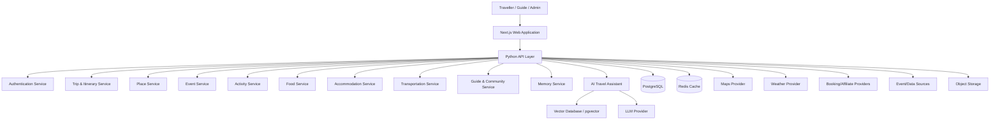

---

# 32. Technology Stack

## Frontend

- Next.js
- React
- TypeScript
- Tailwind CSS
- Component library
- Map SDK
- Responsive PWA-capable UI

## Backend

- Python
- FastAPI
- Pydantic
- SQLAlchemy or SQLModel
- Background workers

## Database

- PostgreSQL
- PostGIS for geographic queries
- pgvector for semantic AI retrieval

## Caching

- Redis

## Storage

Object storage for:

- Photos
- Videos
- User memories
- Guide media

## AI

- LLM API
- Embedding model
- Retrieval-Augmented Generation (RAG)
- Tool/function calling

---

# 33. System Architecture

## Layer 1 — Presentation

Next.js:

```text
Web UI
↓
Trip Dashboard
Destination Pages
Map
AI Chat
Profile
Community
Admin
```

## Layer 2 — API

FastAPI:

```text
Authentication
Trip
Places
Events
Activities
Food
Hotels
Transport
Guides
Memory
AI
```

## Layer 3 — Domain Services

Each major domain should have its own service/module.

## Layer 4 — Data

PostgreSQL + PostGIS + pgvector + Redis + Object Storage.

## Layer 5 — External Integrations

Maps, weather, booking providers, transportation providers, event sources, payment provider, notification provider.

## 33.1 System Architecture — Layered Diagram

Visual view of the five layers above and how they connect.

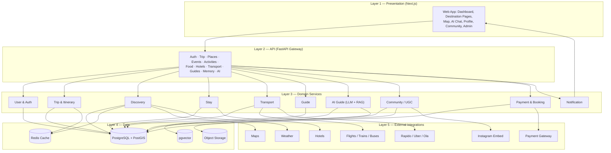

---

# 34. Data Flow Diagram — Level 0

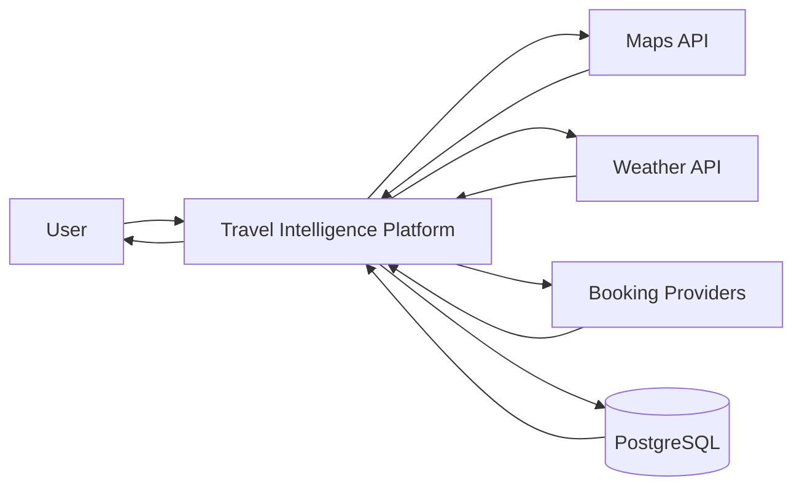

---

# 35. Data Flow Diagram — Level 1

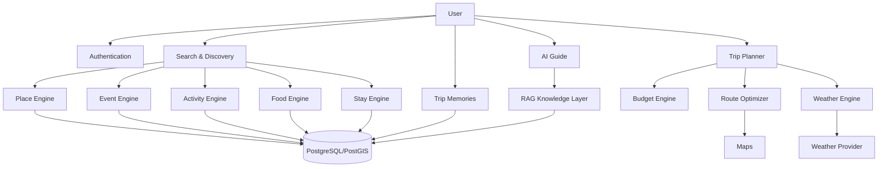

---

# 36. Use Case Diagram

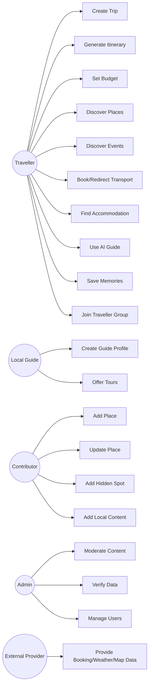

---

# 37. Core Class Diagram

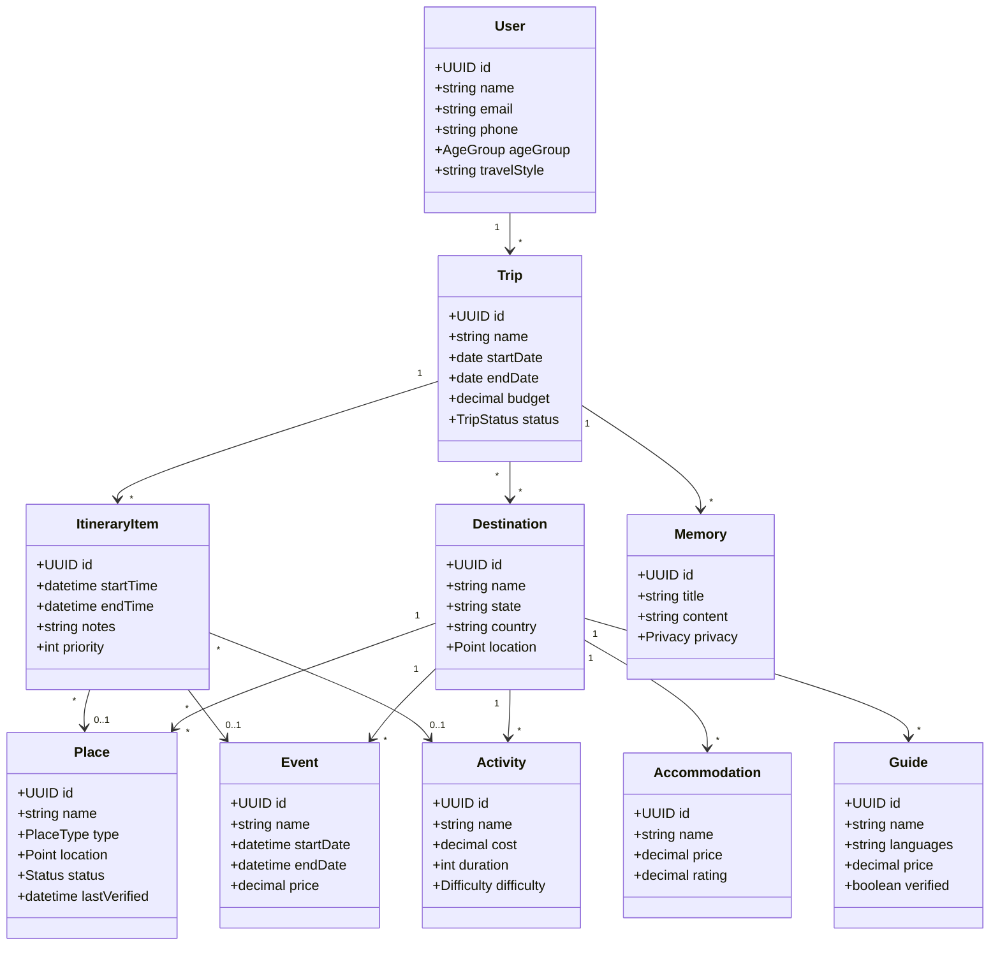

---

# 38. Entity Relationship Diagram

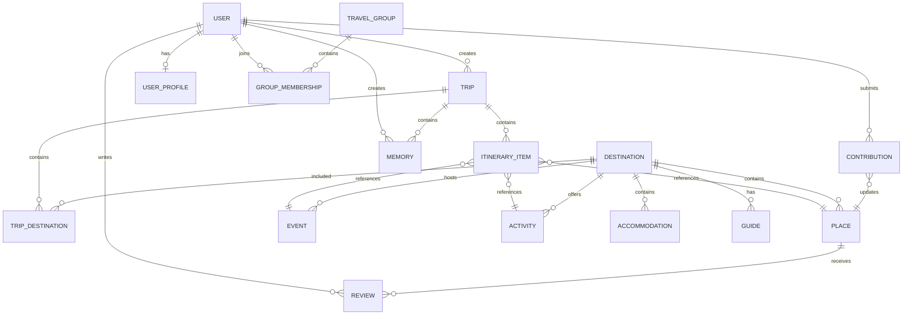

---

# 39. Sequence Diagram — AI Itinerary Generation

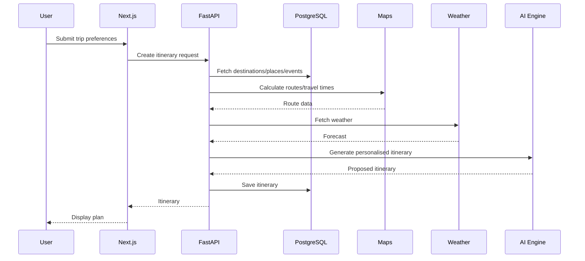

## 39.1 Sequence Diagram — AI Re-Planning on Disruption

How the AI guide adjusts an existing plan when something changes mid-trip
(weather turns bad, a place closes, or the budget is exceeded).

```mermaid
sequenceDiagram
    participant U as User
    participant FE as Next.js
    participant AI as AI Guide (LLM + RAG)
    participant VDB as pgvector
    participant TRIP as Trip Service
    participant DB as PostgreSQL

    U->>FE: "Rain on Day 2 — swap outdoor plans"
    FE->>AI: Chat message + trip context
    AI->>VDB: Retrieve relevant indoor spots / events
    VDB-->>AI: Candidate alternatives
    AI->>TRIP: Fetch current itinerary + budget state
    TRIP->>DB: Read itinerary / spent-so-far
    DB-->>TRIP: Itinerary state
    TRIP-->>AI: Current plan + remaining budget
    AI-->>FE: Revised Day-2 plan (indoor, within budget)
    FE-->>U: Show revised plan; ask to confirm
    U->>FE: Confirm
    FE->>TRIP: Save updated itinerary
    TRIP->>DB: Persist changes
```

---

# 40. Sequence Diagram — Place Status Verification

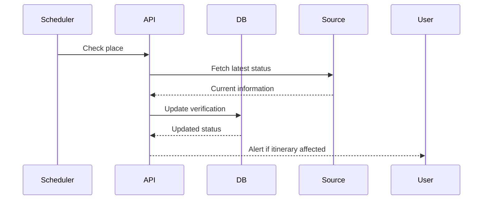

---

# 41. State Diagram — Place Status

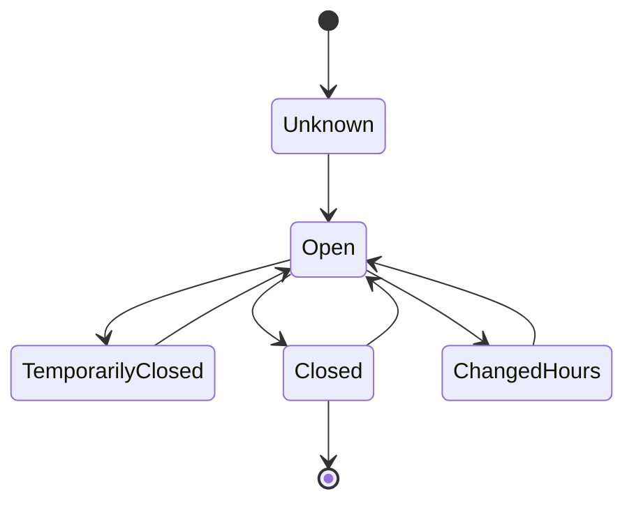

---

# 42. Component Diagram

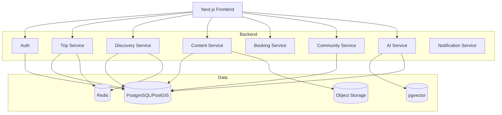

## 42.1 Project / Folder Structure (Codebase Layout)

A code-level view of how the modular monolith is organised in the repository.

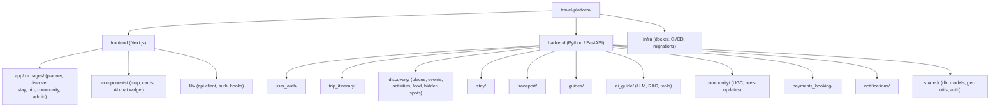

---

# 43. Deployment Architecture

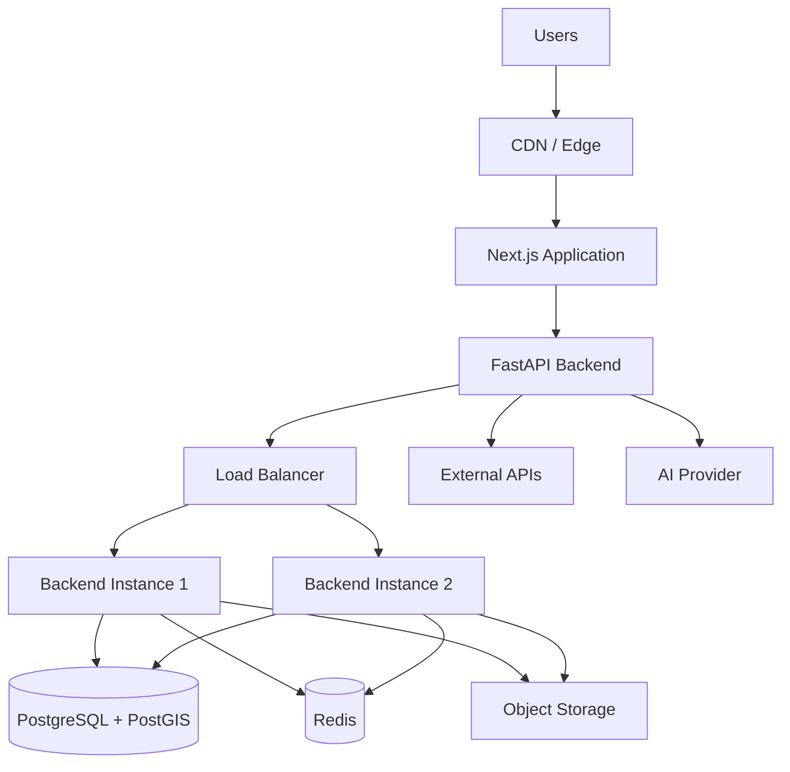

---

# 44. Database Design

## Main Tables

### users

```text
id
name
email
phone
password_hash
role
created_at
updated_at
```

### user_profiles

```text
user_id
age_group
travel_style
budget_level
interests
food_preferences
activity_level
accessibility_preferences
```

### trips

```text
id
user_id
name
start_date
end_date
total_budget
trip_type
status
created_at
```

### destinations

```text
id
name
state
country
latitude
longitude
description
```

### trip_destinations

```text
trip_id
destination_id
sequence
arrival_date
departure_date
```

### itinerary_items

```text
id
trip_id
destination_id
place_id
event_id
activity_id
start_time
end_time
estimated_cost
notes
status
```

### places

```text
id
destination_id
name
category
description
latitude
longitude
status
opening_hours
price_range
rating
source
last_verified_at
```

### events

```text
id
destination_id
name
description
start_date
end_date
location
ticket_price
source
verification_status
```

### activities

```text
id
destination_id
name
category
cost
duration
difficulty
age_min
age_max
weather_dependency
provider_id
```

### accommodations

```text
id
destination_id
name
type
price_min
price_max
rating
location
amenities
booking_url
```

### guides

```text
id
user_id
city
languages
expertise
price
verification_status
rating
```

### reviews

```text
id
user_id
entity_type
entity_id
rating
comment
created_at
```

### memories

```text
id
user_id
trip_id
title
content
privacy
created_at
```

### contributions

```text
id
user_id
entity_type
entity_id
change_type
content
status
moderator_id
created_at
```

---

# 45. API Design

Base URL:

```text
/api/v1
```

## Authentication

```http
POST /auth/register
POST /auth/login
POST /auth/logout
POST /auth/refresh
GET  /auth/me
```

## Trips

```http
POST /trips
GET /trips
GET /trips/{tripId}
PATCH /trips/{tripId}
DELETE /trips/{tripId}
```

## Itinerary

```http
POST /trips/{tripId}/itinerary/generate
GET /trips/{tripId}/itinerary
POST /trips/{tripId}/itinerary/items
PATCH /itinerary/{itemId}
DELETE /itinerary/{itemId}
POST /itinerary/{itemId}/move
```

## Discovery

```http
GET /destinations
GET /places
GET /events
GET /activities
GET /restaurants
GET /accommodations
GET /guides
```

## Location

```http
GET /nearby
GET /routes
```

## AI

```http
POST /ai/chat
POST /ai/itinerary
POST /ai/recommend
```

## Community

```http
POST /contributions
GET /contributions
PATCH /contributions/{id}
```

## Memories

```http
POST /trips/{tripId}/memories
GET /trips/{tripId}/memories
PATCH /memories/{id}
DELETE /memories/{id}
```

---

# 46. AI Architecture

The AI should not directly invent travel facts.

Recommended architecture:

```text
User Question
     ↓
Intent Detection
     ↓
Context Builder
     ↓
Retrieve Verified Data
     ↓
Tool Calls
 ┌───┼────┬──────┐
Maps Weather Events Places
 └───┼────┴──────┘
     ↓
LLM Reasoning
     ↓
Safety / Fact Validation
     ↓
Personalised Response
```

## AI Tools

The AI may call tools such as:

```text
search_places()
search_events()
search_activities()
get_weather()
calculate_route()
find_hotels()
calculate_budget()
get_place_status()
update_itinerary()
search_guides()
```

---

# 47. Recommendation Engine

Initial recommendation score:

```text
Score =
Preference Match
+ Budget Match
+ Distance Score
+ Rating Score
+ Availability
+ Weather Suitability
+ Event Relevance
+ Age/Group Suitability
+ Freshness
```

The weights should be configurable rather than hardcoded permanently.

Later, the platform can learn from:

- Clicks
- Saves
- Visits
- Reviews
- Itinerary edits
- Booking conversions
- User feedback

---

# 48. Data Freshness Architecture

Travel information changes frequently.

Each record should include:

```text
source
source_url
last_verified_at
verification_method
confidence_score
expires_at
```

High-change information:

- Opening hours
- Event dates
- Prices
- Weather
- Place status
- Transport availability

should have shorter refresh intervals.

---

# 49. Data Ingestion

Potential sources:

- Official tourism websites
- Official event websites
- Government/open datasets
- Licensed APIs
- Maps/places APIs
- Hotel/booking APIs
- Transportation APIs
- Verified local contributors

Do not scrape websites in violation of their terms, robots policies, copyright restrictions, or API licensing.

All third-party data should retain source attribution where required.

---

# 50. Admin Dashboard

Admin functions:

### User Management

- Users
- Guides
- Contributors
- Reports
- Suspensions

### Content

- Places
- Events
- Activities
- Restaurants
- Hotels
- Hidden spots

### Verification

- Pending contributions
- Reported places
- Expired data
- Low-confidence data

### Analytics

- Most searched cities
- Most visited places
- Most generated itineraries
- Popular activities
- Booking clicks
- User retention

---

# 51. Notification System

Notifications:

- Trip approaching
- Weather changes
- Place closure
- Event reminder
- Booking reminder
- Itinerary change
- Nearby recommendation
- Group activity
- Guide confirmation

Channels:

- In-app
- Email
- Push notification
- SMS/WhatsApp where legally and commercially supported

Users must control notification preferences.

---

# 52. Security Requirements

- HTTPS everywhere
- Secure password hashing
- JWT/session security
- Refresh token rotation
- Rate limiting
- Input validation
- SQL injection protection
- XSS protection
- CSRF protection where applicable
- Secure file uploads
- Malware/content checks for uploads
- Role-based access control
- Audit logs
- Secrets stored outside source code
- Encryption for sensitive data

---

# 53. Privacy Requirements

The platform handles:

- Location
- Travel dates
- Memories
- Photos
- Personal preferences

Therefore:

- Location permission must be explicit.
- Exact location should not be publicly exposed.
- Public memories require consent.
- Users must be able to delete their content.
- Account deletion must be supported.
- Community matching should expose only necessary information.
- Data retention policies must be defined.

---

# 54. Safety Requirements

The platform should show warnings for:

- Dangerous activities
- Weather-sensitive activities
- Restricted areas
- Unsafe locations
- Closed roads
- Wildlife areas
- Political/security disruptions where verified
- Natural hazards

Adventure activities should include:

- Operator verification where available
- Safety requirements
- Emergency/contact information where appropriate
- User acknowledgement where necessary

---

# 55. Performance Requirements

Target:

- Initial page load: < 2.5 seconds on a good connection
- API p95 for standard reads: < 500 ms where practical
- Search response: < 1.5 seconds where practical
- Cached nearby recommendations: < 500 ms target
- AI response: streaming response preferred

Use:

- CDN
- Server-side rendering
- Static generation for destination pages
- Redis caching
- Database indexes
- PostGIS spatial indexes
- Lazy loading
- Image optimisation

---

# 56. Scalability

Architecture should support:

```text
10,000 users
      ↓
100,000 users
      ↓
1,000,000+ users
```

The backend should be stateless so application instances can scale horizontally.

Long-running operations should use background jobs:

- Data ingestion
- Event updates
- Place verification
- Image processing
- AI embedding generation
- Notification delivery

---

# 57. Recommended Background Processing

Use a queue system for:

```text
Event refresh
Place status refresh
Weather refresh
Recommendation generation
AI embeddings
Email
Push notifications
Image processing
Moderation
```

Possible implementation:

- Celery + Redis
- Dramatiq
- RQ

---

# 58. SEO Requirements

Destination pages should be indexable.

Examples:

```text
/india/rajasthan/jaipur
/india/rajasthan/jodhpur
/india/goa/goa
/india/kerala/kochi
```

SEO pages:

- Best places
- Events
- Activities
- Food
- Hotels
- Hidden places
- Travel guides

Use:

- Metadata
- Open Graph
- Structured data
- Breadcrumbs
- Sitemap
- Robots.txt
- Canonical URLs
- Internal linking

---

# 59. Accessibility

The website should follow WCAG principles.

Requirements:

- Keyboard navigation
- Screen reader support
- Accessible contrast
- Alt text
- Focus indicators
- Semantic HTML
- Adjustable text where practical
- Accessible maps alternatives
- Captions/transcripts for relevant media

---

# 60. Monetisation

Potential revenue:

### 1. Affiliate commissions

- Hotels
- Flights
- Buses
- Activities
- Rentals

### 2. Premium subscription

Premium features:

- Advanced AI itinerary
- Unlimited trip plans
- Offline travel pack
- Advanced budget planning
- Premium local guides

### 3. Local business promotion

Businesses can pay for:

- Featured placement
- Sponsored experiences
- Promotions

Sponsored results must be clearly labelled.

### 4. Guide marketplace

Commission on guide bookings.

### 5. Experience marketplace

Commission on activity bookings.

---

# 61. MVP User Journey

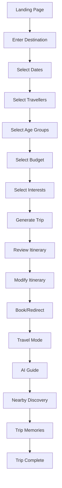

---

# 62. Core Screens

## Public

1. Home
2. Explore
3. Destination page
4. Event page
5. Activity page
6. Place page
7. Hotel page
8. Guide page
9. Blog/travel guide

## Authenticated

10. Dashboard
11. Create Trip
12. Trip Overview
13. Itinerary
14. Map
15. Budget
16. AI Guide
17. Memories
18. Saved Places
19. Traveller Groups
20. Profile

## Contributor

21. Contributor Dashboard
22. Add Place
23. Update Place
24. Add Event
25. Add Hidden Spot

## Admin

26. Admin Dashboard
27. Moderation
28. Verification
29. Data Health
30. Analytics

---

# 63. Trip Dashboard Concept

The trip dashboard should show:

```text
Trip: Rajasthan Explorer
12 Oct – 20 Oct

Budget
₹38,500 / ₹45,000

Weather
32°C / 24°C

Today
Jaipur — Day 2

Next Activity
City Palace — 10:00 AM

Nearby
Food | Shopping | Activities

AI Guide
"Ask anything about your trip"
```

---

# 64. Key Product Differentiator

The platform should not simply be another "places listing website."

Its core differentiator is:

```text
Discovery
+
Planning
+
Budget
+
Real-time Context
+
AI
+
Local Knowledge
+
Community
+
Memory
```

This creates a full travel lifecycle:

```text
Before Trip
     ↓
Plan
     ↓
Book
     ↓
Travel
     ↓
Discover
     ↓
Adapt
     ↓
Remember
     ↓
Share
```

---

# 65. MVP Development Phases

## Phase 1 — Foundation

- Project setup
- Authentication
- PostgreSQL
- PostGIS
- User profile
- Destination database
- Basic maps

## Phase 2 — Discovery

- Places
- Restaurants
- Activities
- Events
- Search
- Filters
- Map discovery

## Phase 3 — Trip Planning

- Trip creation
- Multi-city
- Itinerary
- Budget
- Route optimisation

## Phase 4 — AI

- AI chatbot
- RAG
- Itinerary generation
- Context-aware recommendations
- AI tools

## Phase 5 — Travel Operations

- Weather
- Accommodation
- Transport
- Rental providers
- Place-status updates

## Phase 6 — Community

- Guides
- Contributions
- Hidden spots
- Traveller groups
- Reviews

## Phase 7 — Memories

- Gallery
- Journal
- Expenses
- Sharing

## Phase 8 — Monetisation

- Affiliate links
- Premium
- Guide bookings
- Sponsored listings

---

# 66. MVP Acceptance Criteria

The MVP is considered functional when:

- A user can register.
- A user can create a trip.
- A user can select multiple cities.
- A user can enter dates and budget.
- The system generates an itinerary.
- The itinerary displays on a map.
- Estimated costs are calculated.
- Places and activities can be discovered.
- Events can be displayed.
- Weather can be displayed.
- Accommodation can be discovered.
- Transportation options can be discovered.
- AI can answer trip-related questions.
- Users can modify itinerary items.
- Users can save memories.
- Contributors can submit information.
- Admins can approve/reject submissions.
- Place updates can affect itinerary recommendations.

---

# 67. Testing Strategy

## Unit Testing

Test:

- Budget calculations
- Recommendation scoring
- Date calculations
- Age-group logic
- Route calculations
- Itinerary conflict detection

## Integration Testing

Test:

- PostgreSQL
- Maps
- Weather
- Booking providers
- AI tools

## End-to-End Testing

Critical flow:

```text
Register
→ Create Trip
→ Generate Itinerary
→ Modify Trip
→ View Map
→ Ask AI
→ Save Memory
```

## Security Testing

- Authentication
- Authorisation
- File upload
- API rate limits
- Injection
- XSS
- Privacy

---

# 68. Observability

Use:

- Structured logs
- Error tracking
- Metrics
- API latency monitoring
- Database monitoring
- AI token/cost monitoring
- External API failure monitoring

Important metrics:

```text
Itinerary generation success rate
AI response latency
API error rate
Search success rate
Booking click-through
Daily active users
Trip completion
Recommendation engagement
```

---

# 69. Important Product Rules

1. Never present AI-generated information as verified fact.
2. Show source and freshness for important travel information.
3. Do not expose exact user location publicly.
4. Do not rely on age alone for recommendations.
5. Clearly distinguish estimated and live prices.
6. Use official/licensed APIs where required.
7. Respect third-party platform terms.
8. Moderate user-generated content.
9. Give users control over location permissions.
10. Provide alternative recommendations when a place is closed.
11. Avoid unsafe hidden-location recommendations without verification.
12. Keep booking responsibility and provider terms clear when redirecting externally.

---

# 70. Future Intelligence Layer

After sufficient usage data is available, build a Travel Knowledge Graph:

```text
City
 ↓
Neighbourhood
 ↓
Place
 ↓
Activity
 ↓
Event
 ↓
Restaurant
 ↓
Guide
 ↓
Transport
```

Relationships can include:

```text
NEAR
BEST_FOR
AVAILABLE_DURING
POPULAR_WITH
SIMILAR_TO
CONNECTED_BY
LOCATED_IN
HAPPENS_AT
RECOMMENDED_AFTER
```

This can significantly improve AI recommendations.

---

# 71. High-Level Product Architecture Summary

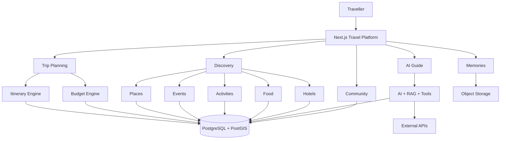

---

# 72. Final Product Definition

The proposed product is a **location-aware AI travel operating system for India**, rather than a simple travel booking website.

The system should help a traveller answer five questions:

### Before travelling

**"Where should I go and how much will it cost?"**

### While planning

**"What should I do each day?"**

### While travelling

**"What should I do right now?"**

### When something changes

**"This place is closed or the weather changed — what should I do instead?"**

### After travelling

**"How can I preserve and share my trip?"**

The final architecture should therefore be built around six major domains:

```text
1. Discovery
2. Planning
3. Booking
4. Real-time Travel Assistance
5. Community
6. Memories
```

The recommended initial implementation is a modular monolith:

```text
Next.js
    ↓
FastAPI
    ↓
Domain Modules
    ↓
PostgreSQL + PostGIS
    ↓
Redis + Object Storage + pgvector
    ↓
External Travel APIs
```

This is preferable for the first production version to avoid the operational complexity of microservices. Individual domains can later be extracted into independent services when scale or team structure justifies it.
